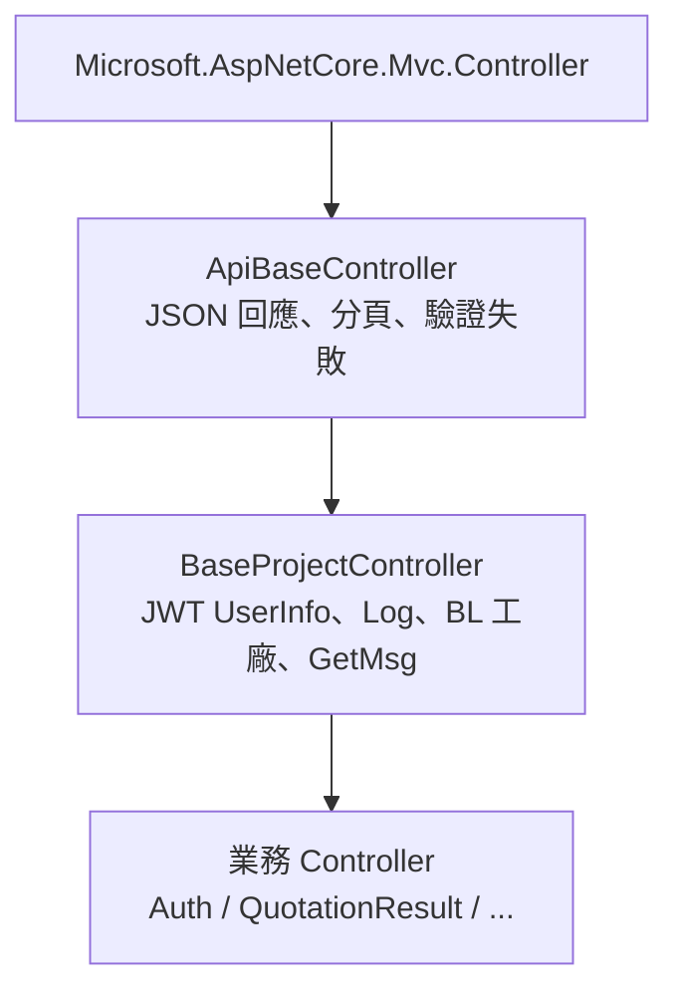

# backend/Controllers 功能總覽

本文件說明 `SanderQuotation/backend/Controllers` 目錄下各 `.cs` 檔案的主要職責、API 路由、核心方法，以及 **frontend MVC 對應頁面**（路由、View、共用元件）。  
所有業務 Controller（除測試用 API）皆繼承 `BaseProjectController` → `ApiBaseController`，並使用 `[CustomAuthorization]` 做功能權限檢查。

---

## 架構關係

---

## 前端對應頁面（總覽）

前端為獨立 MVC 專案（`SanderQuotation/frontend`），業務頁面以 **Razor View + jQuery AJAX** 呼叫 backend 的 `api/*`。  
`Configuration["BackendURL"]` 為 API 基底網址；下列「前端 MVC 路由」為瀏覽器網址（不含 BackendURL）。

| backend Controller | 前端 MVC 路由 | View / 共用元件 | frontend Controller | 備註 |
|--------------------|---------------|-----------------|---------------------|------|
| `AuthController` | `/Login`（預設首頁 `login/Index`） | `Views/Login/Index.cshtml` | — | 登入 POST → `api/auth/AuthDoPost`；登出見 `_topbar.cshtml` → `LogoutDoPost` |
| `QuotationResultController` | `/QuotationResult`、`/QuotationResult/Edit/{id}` | `QuotationResult/Index.cshtml`、`Edit.cshtml`；`_QuickPartSearch`、`_SanderModuleItemPicker` | `QuotationResultController` | 快查掛於 `_topbar`；明細頁含採購型號選擇器 |
| `EsFileTransferUploadController` | `/EsFileTransferUpload` | `EsFileTransferUpload/Index.cshtml` | `EsFileTransferUploadController` | 舊路徑 `/ImportTransferExcel` 會 302 導向本頁（與 `tb_sysfunc.url` 一致） |
| `FilepondEsFileTransferUploadController` | （同上頁內嵌） | 同上 + `_ImportFilepondCommon` | — | `ServerUrl` → `api/FilepondEsFileTransferUpload/` |
| `HistoryFileController` | `/HistoryFile` | `HistoryFile/Index.cshtml` | `HistoryFileController` | FilePond + 清單 CRUD |
| `SanderModuleItemController` | —（無獨立列表頁） | `Shared/_SanderModuleItemPicker.cshtml` | — | 嵌入 `QuotationResult/Edit`、`_QuickPartSearch` |
| `SysSettingController` | `/SysSetting` | `SysSetting/Index.cshtml` | `SysSettingController` | |
| `SysFuncClassController` | `/SysFuncClass`（側欄） | **尚無** `Views/SysFuncClass/` | **尚無** frontend Controller | backend API 已就緒；前端頁面待實作 |
| `CycleSettingsController` | `/CycleSettings` 或 `/Cyclesettings` | `CycleSettings/Index.cshtml` | `CycleSettingsController` | 側欄連結大小寫可能不同 |
| `ESDbTransferMappingController` | `/ESDbTransferMapping`、`/ESDbTransferMapping/DetailView?id=` | `ESDbTransferMapping/Index.cshtml`；DetailView 由 frontend SSR | `ESDbTransferMappingController` | `openDetailView()`（`_CrudCommonScripts`） |
| `TableExcelController` | `/TableExcel` | `TableExcel/Index.cshtml` | `TableExcelController` | 部分下拉呼叫 `api/ESDbTransferMapping/*` |
| `AIChatController` | 全站（需 `_Layout`） | `Shared/_Layout.cshtml` 聊天面板 | — | `api/AIChat/Chat` |
| `TestExternalAPIController` | — | — | — | 無前端頁，僅 API 測試 |
| `ApiBaseController` / `BaseProjectController` | — | — | — | 基底類，無對應頁面 |

### 其他前端頁面（backend API 不在本目錄 15 檔內）

| 前端路由 | View | 主要 backend API |
|----------|------|------------------|
| `/ControlLog` | `ControlLog/Index.cshtml` | `api/ControlLog` |
| `/ESDbTransfer` | `ESDbTransfer/Index.cshtml` | `api/ESDbTransfer` |
| `/SysRole` | `SysRole/Index.cshtml` | `api/SysRole`、`api/SysFunc` |
| `frontend/Controllers/UI/*` | Velzon 範本頁 | **不對應** 上表業務 API |

---

## 共通元件

### ApiBaseController.cs

**前端對應頁面：** 無（JSON/分頁共用基底，由業務 View 的 AJAX 間接使用）。

| 類型 | 名稱 | 主要功能 |
|------|------|----------|
| 欄位 | `ErrorMsgs` | 累積處理過程中的錯誤訊息清單 |
| 方法 | `ErrorAlert` / `WarningAlert` | 將訊息寫入 ViewBag（MVC 頁面用） |
| 方法 | `GetPageEntity`（多載） | 將前端分頁/排序請求轉成 `PageEntity` |
| 方法 | `JsonSuccess` / `JsonOK` | 成功回應：`{ Success: true, Data }` |
| 方法 | `JsonValidFail` / `JsonValiFail` | 失敗回應：`{ Success: false, Message/Errors }` |
| 方法 | `JsonValiFailFromModelState` | 彙整 Model 驗證錯誤為單一 Message |
| 方法 | `GetDomainName` | 取得目前請求的網域 URL |

### BaseProjectController.cs

**前端對應頁面：** 無（JWT、`GetBLInstance`、`LogError` 等由 backend API 與 frontend `BaseProjectController` 各自使用）。

| 類型 | 名稱 | 主要功能 |
|------|------|----------|
| 方法 | `OnActionExecuting` | 從 JWT Claims 填入 `UserInfo`（帳號、姓名、權限） |
| 方法 | `GetBLInstance<T>` | 建立 Business Layer 並注入使用者與組態 |
| 方法 | `GetMsg` | 讀取 `message:zh-tw:{key}` 多語系訊息 |
| 方法 | `LogError` / `LogSuccess` | 寫入 `ControlLog` 操作日誌 |
| 方法 | `RedirectToAlertMsg` | 轉址至 AlertMsg 並帶提示訊息 |
| 方法 | `GetBlSanderModuleItem` 等 | 延遲建立各模組 BL（採購型號、BOM、查價、系統設定等） |

---

## 業務 API Controller

### AuthController.cs

**路由：** `api/auth`  
**用途：** 登入、登出與 JWT Cookie。

**前端對應頁面：**

| 項目 | 路徑 / 說明 |
|------|-------------|
| 登入頁 | MVC `/Login` → `frontend/Views/Login/Index.cshtml`（`AuthDoPost`） |
| 登出 | `frontend/Views/Shared/_topbar.cshtml` → `LogoutDoPost`；`Views/Logout/Logout.cshtml` |

| HTTP | Action | 主要功能 |
|------|--------|----------|
| POST | `AuthDoPost` | 帳密驗證、寫入 JWT Cookie、回傳登入資料 |
| POST | `LogoutDoPost` | 登出並清除伺服器端狀態 |

---

### QuotationResultController.cs

**路由：** `api/QuotationResult`  
**用途：** 定時查價結果（BOM 上傳檔）清單、明細、重新查價、料號快查、決策歷程、價格分群。

**前端對應頁面：**

| MVC 路由 | View | 使用的 API（節錄） |
|----------|------|-------------------|
| `/QuotationResult` | `QuotationResult/Index.cshtml` | `GetPageList` |
| `/QuotationResult/Edit/{id}` | `QuotationResult/Edit.cshtml` | `GetById`、`ReInternalQuotation`、`ReExternalQuotation`、`CheckInStockPrice`、決策/分群 |
| 全站 topbar | `Shared/_QuickPartSearch.cshtml` | `GetCustomerList`、`QuickPartMatch`、`QuickPricing`、決策/分群 |
| 明細 / 快查 | `Shared/_SanderModuleItemPicker.cshtml` | `api/SanderModuleItem/GetPageList` |

| 區塊 | HTTP | Action | 主要功能 |
|------|------|--------|----------|
| 查詢 | GET | `GetPageList` | 分頁清單 |
| 查詢 | GET | `GetById` | 單筆明細（表頭 + 料項 + Mouser/DigiKey） |
| 操作 | POST | `ReInternalQuotation` | 更新採購型號並重新內部查價 |
| 操作 | POST | `ReExternalQuotation` | 重新 Nexar 外部查價 |
| 操作 | POST | `CheckInStockPrice` | Mouser + DigiKey 現貨價寫入 DB |
| 快查 | GET | `GetCustomerList` | 客戶下拉選項 |
| 快查 | GET | `QuickPartMatch` | 僅查料（不寫 DB） |
| 快查 | GET | `QuickPricing` | 勾選執行內部/外部/現貨查價（不寫 DB） |
| 決策 | GET | `GetDecisionLogs` | 料項決策歷程 |
| 決策 | GET | `GetPriceClusterPageList` | 價格分群採購紀錄分頁 |

**依賴：** `QuotationHandler`、`ExternalQueryExecuteHandler`、多個 `GetBl*`（BOM、報價、決策 log 等）。

---

### EsFileTransferUploadController.cs

**路由：** `api/EsFileTransferUpload`  
**用途：** BOM／轉入檔案上傳紀錄的查詢、編輯、刪除與正式上傳設定。

**前端對應頁面：** MVC `/EsFileTransferUpload` → `EsFileTransferUpload/Index.cshtml`（`frontend.Controllers.EsFileTransferUploadController`）。  
頁面 `pageUrls`：`GetPageList`、`GetOptionData`、`Delete`、`SaveUpload`（`SaveEdit` 後端有提供，目前 View 未綁定）。MVC 路由 `/EsFileTransferUpload`（與 DB 選單 `tb_sysfunc.url` 一致）。

| HTTP | Action | 主要功能 |
|------|--------|----------|
| GET | `GetPageList` | 分頁清單 |
| GET | `GetOptionData` | 匯入規則、客戶下拉 |
| POST | `SaveEdit` | 更新客戶代碼等編輯欄位 |
| POST | `Delete` | 批次邏輯刪除 |
| POST | `SaveUpload` | 將 FilePond 暫存轉為正式資料並觸發後續流程 |

---

### FilepondEsFileTransferUploadController.cs

**路由：** `api/FilepondEsFileTransferUpload`  
**用途：** FilePond 分塊上傳協定（Process / Patch / Revert），供轉入檔案上傳頁使用。

**前端對應頁面：** 與 `EsFileTransferUpload` 同一頁；`Index.cshtml` 內 `ServerUrl` 指向 `api/FilepondEsFileTransferUpload/`（Process / Patch / Revert）。

| HTTP | Action | 主要功能 |
|------|--------|----------|
| POST | `Process` | 接收檔案並建立暫存上傳紀錄 |
| PATCH | `Patch` | 分塊續傳 |
| DELETE | `Revert` | 取消上傳並清理暫存 |

---

### HistoryFileController.cs

**路由：** `api/HistoryFile`  
**用途：** 歷史檔案管理（上傳、分塊、下載、清單、編輯、刪除）。

**前端對應頁面：** MVC `/HistoryFile` → `HistoryFile/Index.cshtml`（`HistoryFileController`）；含 FilePond 與 `GetPageList`、`Upload`、`Download`、`Edit`、`Delete`。

| HTTP | Action | 主要功能 |
|------|--------|----------|
| POST | `Process` | FilePond 初始上傳 |
| PATCH | `Patch` | 分塊上傳 |
| GET | `Download/{id}` | 下載檔案 |
| DELETE | `Revert` | 取消上傳 |
| POST | `Upload` | 完成上傳並寫入 DB |
| GET | `GetPageList` | 分頁清單 |
| POST | `Delete` | 批次刪除 |
| POST | `Edit` | 編輯紀錄 |

---

### SanderModuleItemController.cs

**路由：** `api/SanderModuleItem`  
**用途：** 內部採購型號主檔查詢；含 Excel 匯入私有方法（開發維護用）。

**前端對應頁面：** 無獨立 Index；`Shared/_SanderModuleItemPicker.cshtml`（嵌入查價明細與快查）。匯入方法為後端維護用，無前端 UI。

| HTTP | Action | 主要功能 |
|------|--------|----------|
| GET | `GetPageList` | 分頁查詢採購型號 |

**私有方法：** `ImportSandermoduleItem`、`ImportSanderModuleItemVariant`、`ImportReportItemCustomer`、`ImportSanderModulePurchaseLine`（從 wwwroot Excel 匯入）。

---

### SysSettingController.cs

**路由：** `api/SysSetting`  
**用途：** 系統參數（AI 決策顯示開關、偏好廠商、品牌比對類別）。

**前端對應頁面：** MVC `/SysSetting` → `SysSetting/Index.cshtml`（`GetData`、`Create`、`Edit`、`Delete`、`SaveOther`）。

| HTTP | Action | 主要功能 |
|------|--------|----------|
| GET | `GetData` | 取得全部設定 VM |
| POST | `Create` | 新增清單項目 |
| POST | `Edit` | 編輯清單項目 |
| POST | `Delete` | 刪除項目 |
| POST | `SaveOther` | 儲存 AI 開關等「其他」設定 |

---

### SysFuncClassController.cs

**路由：** `api/SysFuncClass`  
**用途：** 系統功能類別維護（選單/權限分類）。

**前端對應頁面：** 側欄連結 `/SysFuncClass`（`Shared/_sidebar.cshtml`）；**尚無**對應 View 與 frontend Controller，需新增頁面並綁定 `api/SysFuncClass/*`。

| HTTP | Action | 主要功能 |
|------|--------|----------|
| GET | `GetPageList` | 分頁清單 |
| POST | `Get` | 單筆查詢 |
| POST | `Create` | 新增 |
| POST | `Edit` | 編輯 |
| POST | `Delete` | 批次刪除 |
| POST | `Enable` | 啟用/停用 |
| GET | `GetAll` | 下拉選項 |

---

### CycleSettingsController.cs

**路由：** `api/cycle-settings`  
**用途：** 排程週期設定與 Hangfire 定時轉檔、執行紀錄查詢。

**前端對應頁面：** MVC `/CycleSettings`（側欄可能為 `/Cyclesettings`）→ `CycleSettings/Index.cshtml`；`pageUrls` 對應 `api/cycle-settings/*`。

| HTTP | Action | 主要功能 |
|------|--------|----------|
| GET | `GetPageList` | 分頁清單（含 Hangfire 狀態） |
| GET | `Get` | 單筆 |
| POST | `Create` | 新增並註冊 Recurring Job |
| POST | `Edit` | 編輯並更新 Job |
| POST | `Delete` | 刪除並移除 Job |
| GET | `GetSelectList` | DB/檔案轉檔下拉 |
| POST | `ExecuteNow/{rowGuid}` | 手動觸發排程 |
| GET | `GetRecentLogs` | 執行紀錄與錯誤明細 |

---

### ESDbTransferMappingController.cs

**路由：** `api/ESDbTransferMapping`  
**用途：** DB 轉檔「對應規則」維護（來源/目標表欄位對應）。

**前端對應頁面：** MVC `/ESDbTransferMapping` → `ESDbTransferMapping/Index.cshtml`（清單 CRUD + 結構查詢 API）；詳細頁 `/ESDbTransferMapping/DetailView?id=` 由 `frontend.Controllers.ESDbTransferMappingController.DetailView` SSR（View 名稱 `DetailView`，檔案可能與 Index 同資料夾或待補）。

| HTTP | Action | 主要功能 |
|------|--------|----------|
| GET | `GetPageList` | 分頁清單 |
| POST | `Get` | 單筆 |
| POST | `Create` | 新增 |
| POST | `Edit` | 編輯 |
| POST | `Delete` | 刪除 |
| GET | `GetColumns` | 依規則代碼取欄位 |
| GET | `GetDbTransferList` | 連線清單 |
| GET | `GetSourceTables` / `GetSourceColumns` | 來源 DB 結構 |
| GET | `GetTargetTables` / `GetTargetColumns` | 目標 DB 結構 |

---

### TableExcelController.cs

**路由：** `api/TableExcel`  
**用途：** Excel/CSV 匯入規則設定（對應資料表、欄位、範例檔、上傳解析）。

**前端對應頁面：** MVC `/TableExcel` → `TableExcel/Index.cshtml`；並呼叫 `api/ESDbTransferMapping` 的 `GetDbTransferList`、`GetTargetTables`、`GetTargetColumns` 作下拉/欄位來源。

| HTTP | Action | 主要功能 |
|------|--------|----------|
| GET | `GetPageList` | 分頁清單 |
| POST | `Create` | 新增規則 |
| GET | `Get` | 單筆 |
| GET | `GetExampleFile` | 下載範例檔 |
| POST | `Update` | 更新 |
| POST | `Delete` | 刪除 |
| POST | `UploadExcel` | 上傳 Excel 暫存 |
| GET | `GetTableList` | 資料庫表清單 |
| GET | `GetTableColumns` | 表欄位 |
| GET | `GetExcelColumns` / `GetSheetColumns` | 解析檔案欄位 |

---

### AIChatController.cs

**路由：** `api/AIChat`  
**用途：** AI 對話、Session 清除、AI 產生檔案下載。

**前端對應頁面：** `Shared/_Layout.cshtml` 內建聊天 UI → `api/AIChat/Chat`（`Session`、`DownloadAIFile` 若 Layout 有擴充則同專案路徑）。

| HTTP | Action | 主要功能 |
|------|--------|----------|
| POST | `Chat` | 多輪對話（含 SQL/工具結果） |
| DELETE | `Session/{sessionId}` | 清除對話歷史 |
| GET | `DownloadAIFile` | 下載 AI 產出檔（如 Excel） |

---

### TestExternalAPIController.cs

**路由：** `api/TestExternalAPI`  
**用途：** 開發/測試用，直接呼叫 Mouser、DigiKey 查價 API（`[AllowAnonymous]`）。

**前端對應頁面：** 無（Postman / 測試工具直接呼叫 `QueryMouser`、`QueryDk`）。

| HTTP | Action | 主要功能 |
|------|--------|----------|
| POST | `QueryMouser` | 測試 Mouser 查價 |
| POST | `QueryDk` | 測試 DigiKey 查價 |

---

## 檔案清單（15 個）

| 檔案 | 類型 | 前端對應頁面（MVC 路由 → View） | 一句話說明 |
|------|------|--------------------------------|------------|
| `ApiBaseController.cs` | 基底 | — | AJAX JSON 與分頁共用方法 |
| `BaseProjectController.cs` | 基底 | — | 授權使用者、日誌、BL、多語系訊息 |
| `AuthController.cs` | API | `/Login` → `Login/Index`；登出 `_topbar` | 登入/登出 |
| `QuotationResultController.cs` | API | `/QuotationResult`、`/Edit/{id}`；`_QuickPartSearch` | 定時查價結果與快查 |
| `EsFileTransferUploadController.cs` | API | `/EsFileTransferUpload` | 轉入檔案 CRUD |
| `FilepondEsFileTransferUploadController.cs` | API | 同上頁 FilePond | FilePond 上傳協定 |
| `HistoryFileController.cs` | API | `/HistoryFile` | 歷史檔案管理 |
| `SanderModuleItemController.cs` | API | `_SanderModuleItemPicker` 元件 | 採購型號查詢/匯入 |
| `SysSettingController.cs` | API | `/SysSetting` | 系統參數 |
| `SysFuncClassController.cs` | API | 側欄 `/SysFuncClass`（頁面待實作） | 功能類別 |
| `CycleSettingsController.cs` | API | `/CycleSettings` | 排程週期與執行紀錄 |
| `ESDbTransferMappingController.cs` | API | `/ESDbTransferMapping`、`DetailView` | DB 轉檔對應規則 |
| `TableExcelController.cs` | API | `/TableExcel` | Excel 匯入規則 |
| `AIChatController.cs` | API | `_Layout` 聊天面板 | AI 對話 |
| `TestExternalAPIController.cs` | API | — | 外部查價測試 |

---

## 常見回應格式

| 方法 | 結構 | 典型情境 |
|------|------|----------|
| `JsonSuccess(data)` | `{ Success: true, Data: ... }` | 查詢/操作成功 |
| `JsonOK()` / `JsonOK(msg)` | `{ Success: true [, Data: msg] }` | 寫入成功 |
| `JsonValidFail(msg)` | `{ Success: false, Message: msg }` | 業務錯誤、資料不存在 |
| `GetMsg(config, "System_Error")` | 字串 | catch 區塊系統錯誤 |

---

## 備註

- 各 Action 的 XML 註解（功能說明、參考功能、輸入/輸出、訊息條件）已寫於原始 `.cs` 檔，IDE 快速資訊可查看。
- **前端對應**以 `frontend/Views` 與 View 內 `BackendURL`/`pageUrls` 為準；選單 `href` 與 Controller 名稱不一致時以實際可開啟路由為準。
- 本文件依目前程式碼整理；若新增 Controller、View 或重構至 AppService，請同步更新此 MD（含前端欄位）。

*產生日期：依專案 Controllers 目錄現況整理。*
