# BOM 智慧查價系統規格書

> 版本：v1.2　　更新日期：2026-05-07

---

## 目錄

1. [系統概述](#1-系統概述)
2. [系統管理](#2-系統管理)
   - [SYS01 帳號管理](#sys01-帳號管理)
   - [SYS02 角色管理](#sys02-角色管理)
   - [SYS03 操作記錄](#sys03-操作記錄)
3. [查價轉檔執行模組](#3-查價轉檔執行模組)
   - [M01 資料庫連線設定](#m01-資料庫連線設定)
   - [M02 資料表轉檔設定](#m02-資料表轉檔設定)
   - [M03 檔案轉入資料表對應設定](#m03-檔案轉入資料表對應設定)
   - [M04 排程設定](#m04-排程設定)
4. [採購管理](#4-採購管理)
   - [F01 BOM 檔案上傳](#f01-bom-檔案上傳)
   - [F02 查價結果管理](#f02-查價結果管理)
   - [F03 料號快查](#f03-料號快查)
5. [AI對話中心](#5-ai對話中心)
6. [AI資料管理](#6-ai資料管理)
   - [A01 歷史資料上傳](#a01-歷史資料上傳)
7. [狀態碼定義](#7-狀態碼定義)

---

## 1. 系統概述

本系統為 BOM 智慧查價系統，整合系統帳號權限管理、資料同步排程作業與採購查價流程，協助企業採購人員以自動化方式完成 BOM 料號比對、內部採購價格查詢及外部市場報價取得，最終產出含建議價格的查價結果供採購確認。

**系統模組架構：**

| 模組 | 說明 |
|------|------|
| 系統管理 | 管理使用者帳號、角色權限與操作記錄 |
| 查價轉檔執行模組 | 設定資料來源、建立同步規則、排程自動執行、監控執行狀態 |
| 採購管理 | BOM 上傳、查價結果查看、單一料號快查 |
| AI資料管理 | 歷史資料上傳 |

**採購核心操作流程：**

```
採購上傳 BOM → 選擇客戶 → 系統自動查料（內部比對）→ 內部查價 → 外部查價 → 產出結果
```

---

## 2. 系統管理

系統管理模組提供使用者帳號管理、角色與系統操作記錄查詢等功能，通常由系統管理員負責維護。

---

### SYS01 帳號管理

#### 功能說明

管理系統使用者帳號，包含帳號新增、編輯、啟用／停用，以及角色指派。

#### 畫面示意

##### 清單表格
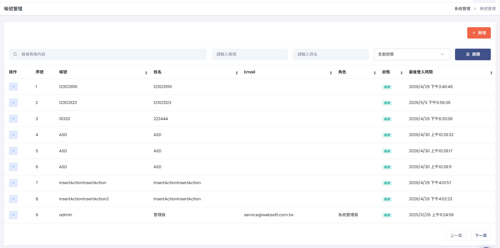
##### 新增/編輯
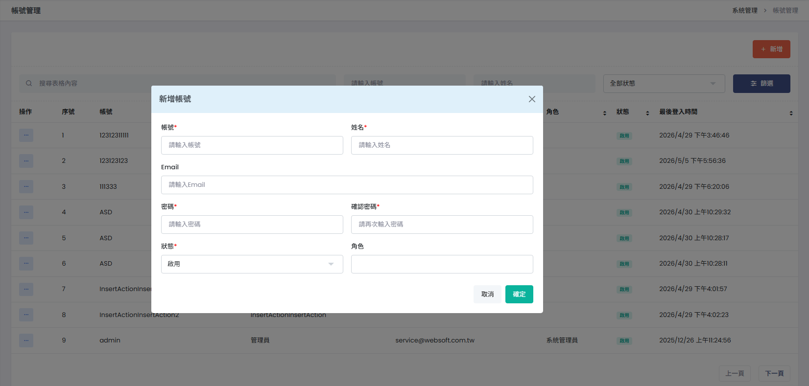

#### 清單表格欄位

| 欄位 | 說明 |
|------|------|
| 帳號 | 使用者登入帳號 |
| 姓名 | 使用者顯示名稱 |
| Email | 電子郵件 |
| 角色 | 所指派的角色名稱 |
| 狀態 | 啟用 / 停用 |
| 最後登入時間 | 上次登入紀錄 |

#### 查詢條件

- 關鍵字（帳號、姓名）
- 狀態（全部 / 啟用 / 停用）

#### 新增 / 編輯欄位

| 欄位 | 必填 | 說明 |
|------|------|------|
| 帳號 | ✓ | 登入帳號，不可重複 |
| 姓名 | ✓ | 顯示名稱 |
| Email | | 電子郵件 |
| 密碼 | ✓（新增）| 編輯時留空則保留原密碼 |
| 確認密碼 | ✓（新增）| 與密碼一致 |
| 狀態 | ✓ | 啟用 / 停用 |
| 角色 | | 可指派多個角色 |

#### 操作功能

- 新增帳號
- 編輯帳號資訊
- 啟用 / 停用帳號

---

#### 功能說明

定義系統中各個功能頁面，並設定各功能可授予的操作權限項目（如：查看、新增、編輯、刪除），供角色管理引用。

#### 畫面示意

##### 清單表格
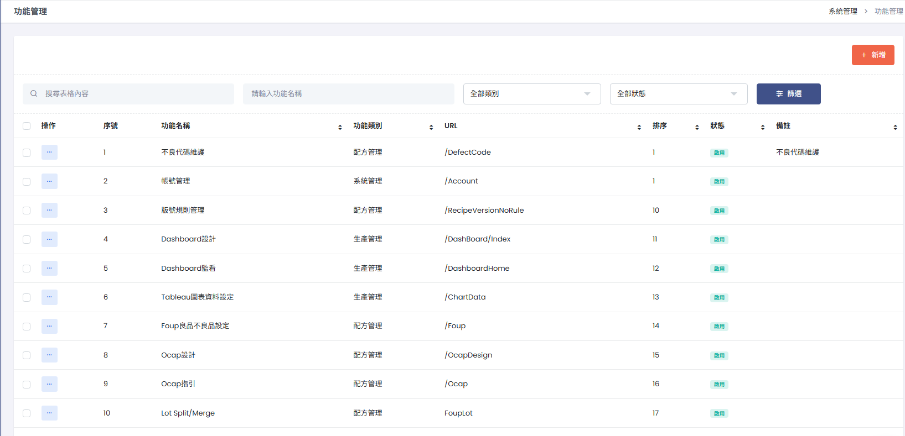
##### 新增/編輯
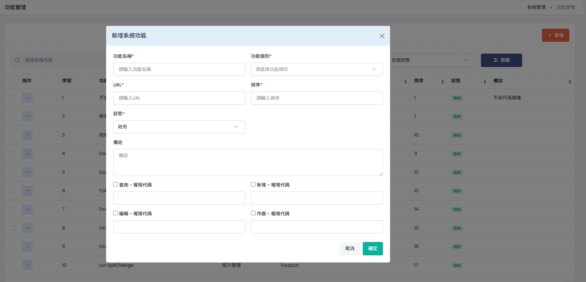

#### 清單表格欄位

| 欄位 | 說明 |
|------|------|
| 功能名稱 | 功能顯示名稱 |
| 功能類別 | 所屬類別 |
| 排序 | 顯示順序 |
| 狀態 | 啟用 / 停用 |
| 備註 | 說明文字 |

#### 新增 / 編輯欄位

| 欄位 | 必填 | 說明 |
|------|------|------|
| 功能名稱 | ✓ | 功能顯示名稱 |
| 功能類別 | ✓ | 下拉選取，來自 功能類別資料 |
| 排序 | ✓ | 數字，影響側邊選單顯示順序 |
| 狀態 | ✓ | 啟用 / 停用 |
| 備註 | | 說明文字 |
| 權限項目 | | 設定此功能所包含的操作權限代碼，通常由開發人員設定（例如：查看、新增、編輯、刪除） |

#### 操作功能

- 新增 / 編輯 / 刪除（支援批次刪除）
- 啟用 / 停用

---

### SYS02 角色管理

#### 功能說明

定義使用者角色，並針對每個角色設定各功能頁面的操作權限。帳號可被指派一個或多個角色。

#### 畫面示意

##### 清單表格
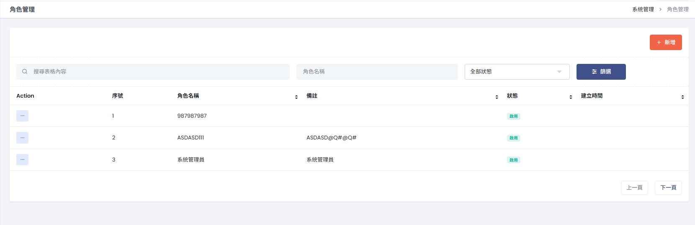
##### 新增/編輯
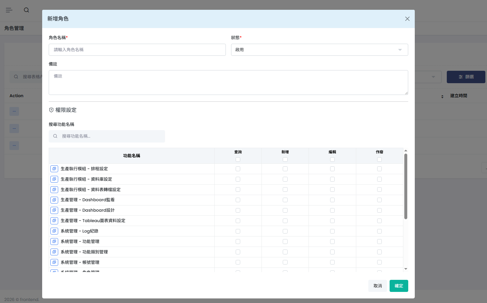

#### 清單表格欄位

| 欄位 | 說明 |
|------|------|
| 角色名稱 | 角色顯示名稱 |
| 狀態 | 啟用 / 停用 |
| 備註 | 說明文字 |
| 建立時間 | 建立日期時間 |

#### 新增 / 編輯欄位

| 欄位 | 必填 | 說明 |
|------|------|------|
| 角色名稱 | ✓ | 角色顯示名稱 |
| 狀態 | ✓ | 啟用 / 停用 |
| 備註 | | 說明文字 |
| 權限設定表 | | 依功能列表，勾選各功能可執行的操作（查看/新增/編輯/刪除等） |

**權限設定說明：** 編輯角色時，畫面下方顯示所有功能清單，每列為一個功能，每欄為該功能所定義的操作項目，勾選後即表示該角色可執行該操作。可依功能名稱關鍵字搜尋，並支援整列全選。

#### 操作功能

- 新增 / 編輯
- 啟用 / 停用

---

### SYS03 操作記錄

#### 功能說明

查看系統使用者的操作歷史紀錄，用於稽核與問題追蹤。本頁面僅供查詢，不提供新增或刪除。

#### 畫面示意

##### 清單表格
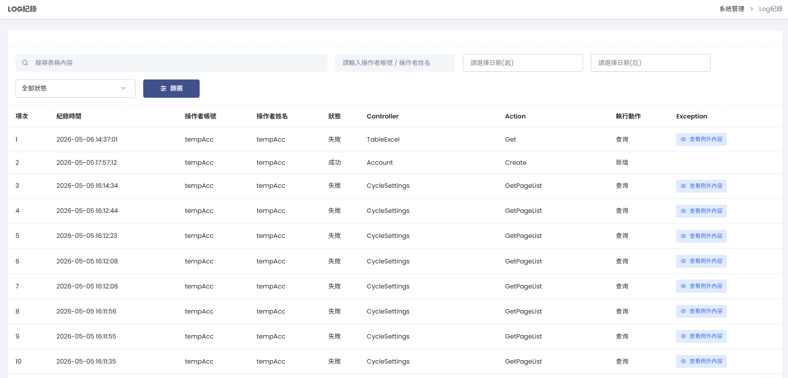
##### 查看例外內容
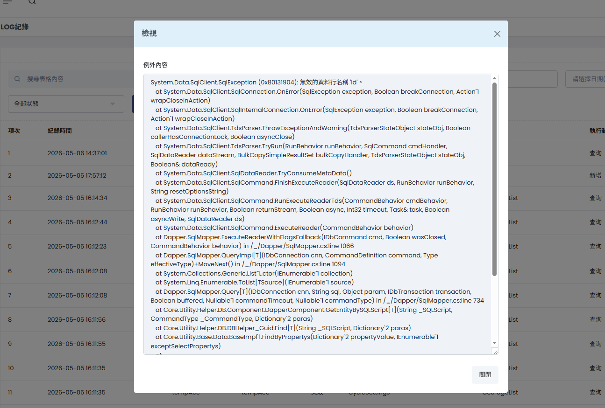

#### 清單表格欄位

| 欄位 | 說明 |
|------|------|
| 紀錄時間 | 操作發生的日期時間 |
| 操作者帳號 | 執行操作的使用者帳號 |
| 操作者姓名 | 執行操作的使用者姓名 |
| 狀態 | 成功 / 失敗 |
| 執行動作 | 操作描述 |
| 例外內容 | 失敗時可查看詳細錯誤訊息（按鈕） |

#### 查詢條件

- 關鍵字（操作者帳號或姓名）
- 日期區間（起訖）
- 狀態（成功 / 失敗）

#### 查看例外內容欄位
| 欄位 | 說明 |
|------|------|
| 例外內容 | 操作發生的錯誤內容 |

---

## 3. 查價轉檔執行模組

查價轉檔執行模組負責管理資料來源連線、定義資料同步與檔案匯入規則，並透過排程自動執行，將外部資料同步至本系統，作為後續查料與查價的資料基礎。

> **模組說明：** 此模組一般由系統建置階段完成初始設定，日後依資料來源變動進行維護。正常運作期間由排程自動執行，使用者不需頻繁操作。

---

### M01 資料庫連線設定

#### 功能說明

統一管理各資料庫的連線資訊，作為後續資料表轉檔設定與排程設定的來源資料庫參照。支援 PostgreSQL 與 MSSQL 兩種資料庫類型。

#### 畫面示意

##### 清單表格
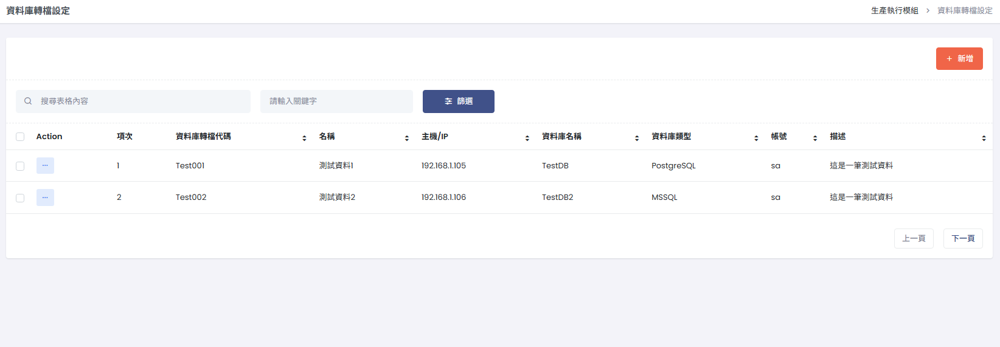
##### 新增/編輯
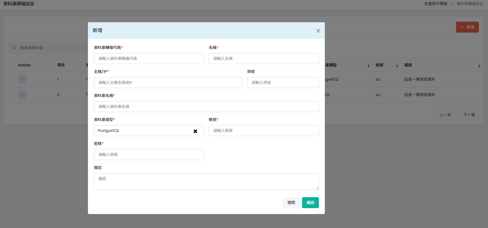

#### 清單表格欄位

| 欄位 | 說明 |
|------|------|
| 資料庫轉檔代碼 | 識別代碼 |
| 名稱 | 顯示名稱 |
| 主機 / IP | 資料庫伺服器位址 |
| 資料庫名稱 | 所連接的資料庫名稱 |
| 資料庫類型 | PostgreSQL / MSSQL |
| 帳號 | 連線帳號 |
| 描述 | 說明文字 |

#### 新增 / 編輯欄位

| 欄位 | 必填 | 說明 |
|------|------|------|
| 資料庫轉檔代碼 | ✓ | 唯一識別碼 |
| 名稱 | ✓ | 顯示名稱 |
| 主機 / IP | ✓ | 伺服器位址 |
| 埠號 | | 連接埠，選填 |
| 資料庫名稱 | ✓ | 資料庫名稱 |
| 資料庫類型 | ✓ | PostgreSQL / MSSQL |
| 帳號 | ✓ | 連線帳號 |
| 密碼 | ✓ | 連線密碼 |
| 描述 | | 說明文字 |

#### 操作功能

- 新增 / 編輯 / 刪除（支援批次刪除）
> **刪除說明：** 如果資料表轉檔設定 與 檔案轉入資料表對應設定 有使用到資料庫資訊，那麼不能刪除該筆資料庫連線設定
---

### M02 資料表轉檔設定

#### 功能說明

定義資料庫間的資料表同步規則，指定來源資料庫的哪個資料表同步至目標資料庫的哪個資料表，並設定欄位對應關係與篩選條件，確保只同步所需資料。

#### 畫面示意

##### 清單表格
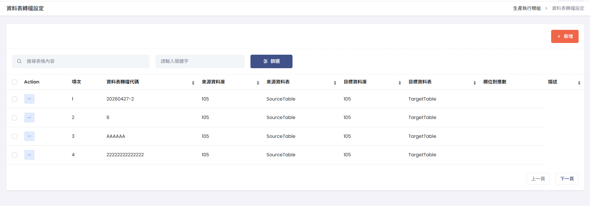
##### 新增/編輯
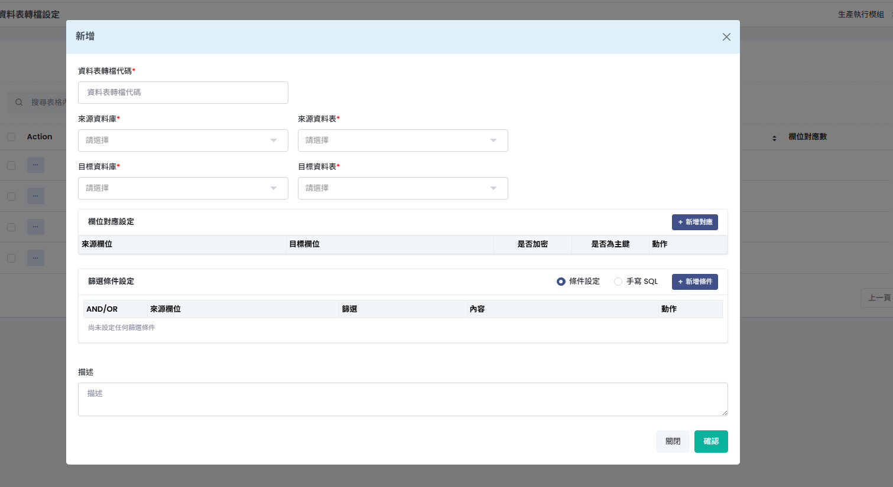

#### 清單表格欄位

| 欄位 | 說明 |
|------|------|
| 資料表轉檔代碼 | 識別代碼 |
| 來源資料庫 | 資料來源 |
| 來源資料表 | 來源資料表名稱 |
| 目的資料庫 | 目標資料庫 |
| 目的資料表 | 目標資料表名稱 |
| 欄位對應數 | 已設定的欄位對應筆數 |
| 描述 | 說明文字 |

#### 新增 / 編輯欄位

**基本設定**

| 欄位 | 必填 | 說明 |
|------|------|------|
| 資料表轉檔代碼 | ✓ | 唯一識別碼 |
| 來源資料庫 | ✓ | 從 資料庫連線設定 已設定的連線中選取 |
| 來源資料表 | ✓ | 選取後系統自動讀取來源資料表清單 |
| 目的資料庫 | ✓ | 從 資料庫連線設定 已設定的連線中選取 |
| 目的資料表 | ✓ | 選取後系統自動讀取目標資料表清單 |

> **基本設定說明：** 來源資料庫與目的資料庫可以一樣，系統會跳警告出來詢問是否要繼續，如下圖
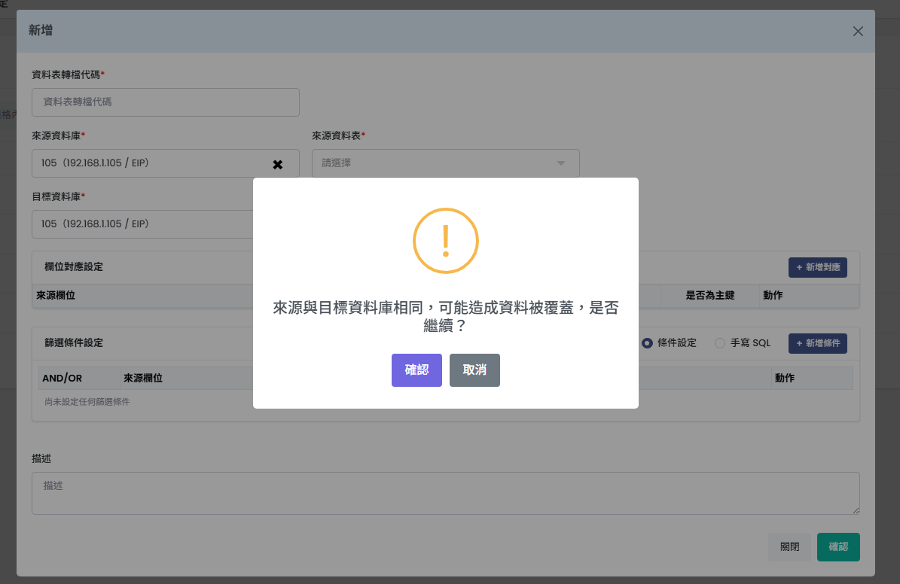

**欄位對應設定**

每筆欄位對應包含：

| 子欄位 | 說明 |
|--------|------|
| 來源欄位 | 來源資料表的欄位（系統自動載入） |
| 目的欄位 | 對應的目標資料表欄位（系統自動載入） |
| 是否加密 | 存入目標資料庫時是否加密 |
| 是否為主鍵 | 用於比對與更新的索引鍵 |

**篩選條件設定**

設定只同步部分資料的過濾條件，提供兩種模式：

- **視覺化條件設定**：以介面選擇欄位、條件與值（支援 AND / OR 組合）
- **手動輸入模式**：直接輸入條件語句（供進階設定使用）

#### 操作功能

- 新增 / 編輯 / 刪除（支援批次刪除）
> **刪除說明：** 如果排程設定 有使用到資料表轉檔設定，那麼不能刪除該筆資料表轉檔設定
---

### M03 檔案轉入資料表對應設定

#### 功能說明

定義 Excel 檔案匯入至系統資料表的規則，用於 F01「BOM 檔案上傳」時所選取的「匯入規則」設定項目。每筆設定包含：Excel 範本上傳、工作表與資料表對應，以及欄位對應。

#### 畫面示意
##### 清單表格
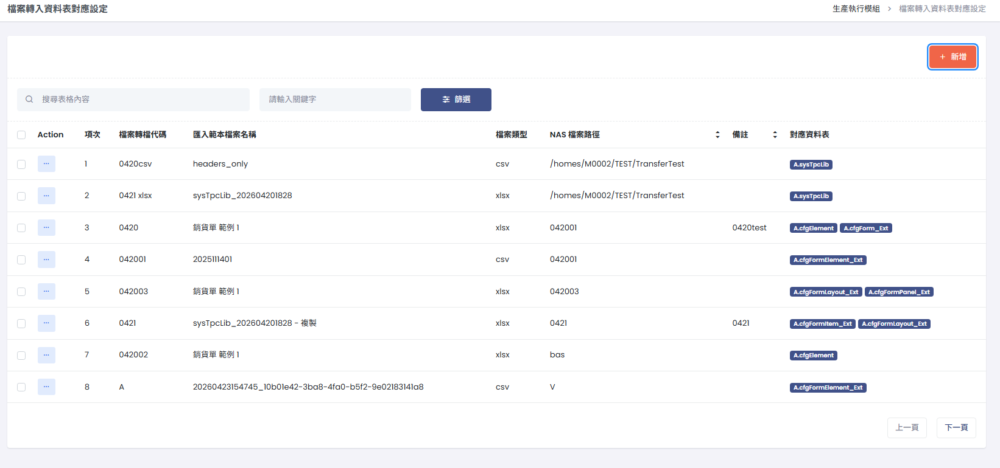
##### 新增流程
* 步驟1

* 步驟2
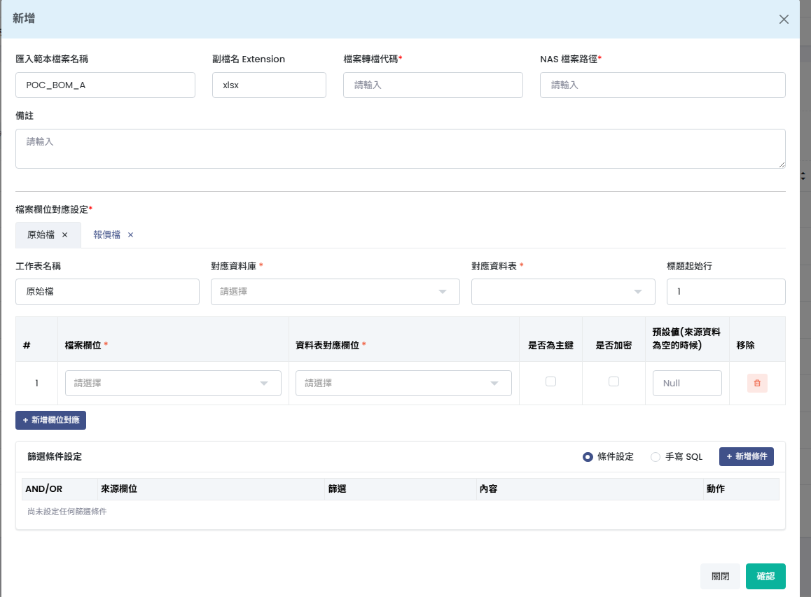

#### 清單表格欄位

| 欄位 | 說明 |
|------|------|
| 檔案轉檔代碼 | 識別代碼 |
| 匯入範本檔案名稱 | 用於定義欄位格式的 Excel 範本名稱 |
| 檔案類型 | xlsx / xls |
| NAS 檔案路徑 | 系統監控的檔案目錄路徑 |
| 備註 | 說明文字 |
| 對應資料表 | 此設定對應的目標資料表 |

#### 新增流程（兩步驟精靈）

**步驟一：上傳 Excel 範本**

- 拖曳或選擇 Excel 範本檔案（.xlsx / .xls）
- 系統自動解析工作表（Sheet）清單
- 勾選需要設定匯入的工作表（可多選）
- 點選「下一步」繼續

**步驟二：設定欄位對應**

| 欄位 | 必填 | 說明 |
|------|------|------|
| 匯入範本檔案名稱 | | 自動填入 |
| 檔案轉檔代碼 | ✓ | 唯一識別碼 |
| NAS 檔案路徑 | ✓ | 系統監控目錄 |
| 備註 | | 說明 |

針對每個選取的工作表，分別設定：

| 欄位 | 必填 | 說明 |
|------|------|------|
| 工作表名稱 | | 自動填入 |
| 對應資料庫 | ✓ | 目標資料庫 |
| 對應資料表 | ✓ | 目標資料表 |

**欄位對應 table（每個工作表）**

| 子欄位 | 說明 |
|--------|------|
| 檔案欄位 | 來自 Excel 標題列的欄位名稱（自動讀取） |
| 資料表對應欄位 | 對應的目標資料表欄位（下拉選取） |
| 是否為主鍵 | 用於比對與更新 |
| 是否加密 | 存入時是否加密 |
| 預設值 | 來源欄位為空時的填充值 |

同樣支援篩選條件設定（視覺化或手動模式）。

#### 操作功能

- 新增 / 編輯 / 刪除（支援批次刪除）
> **刪除說明：** 如果排程設定 有使用到檔案轉入資料表對應設定，那麼不能刪除該筆檔案轉入資料表對應設定
---

### M04 排程設定

#### 功能說明

設定自動化排程，定期執行資料庫轉檔（M02）或檔案匯入（M03）作業。支援多種執行週期，並可指定每次排程執行哪些轉檔任務。

#### 畫面示意
##### 清單表格
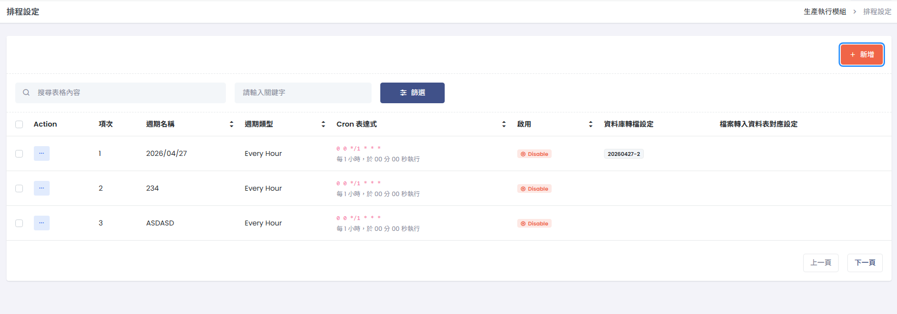
##### 新增/編輯
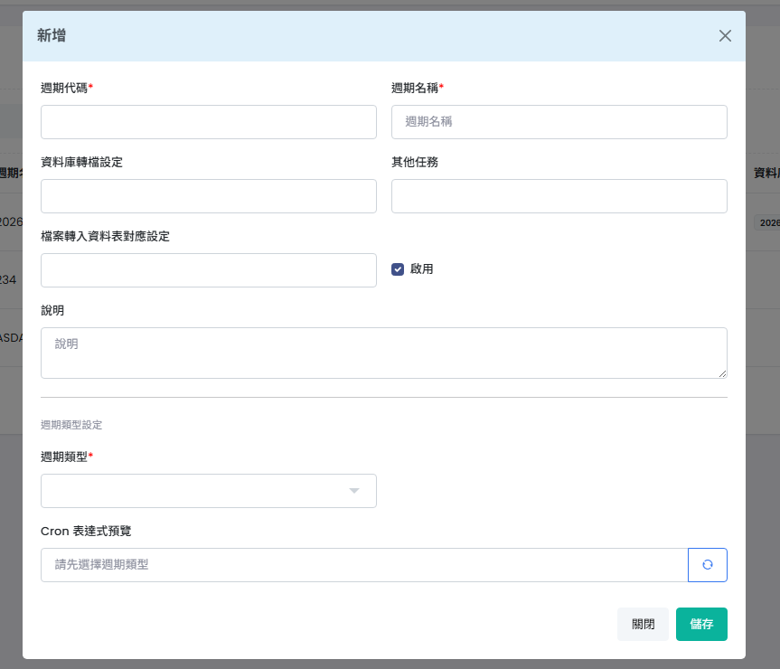

#### 清單表格欄位

| 欄位 | 說明 |
|------|------|
| 排程名稱 | 排程顯示名稱 |
| 排程類型 | 每秒 / 每分鐘 / 每小時 / 每天 / 每週 / 每月 |
| 執行週期（Cron） | 系統自動產生的週期表示式 |
| 啟用狀態 | 啟用 / 停用 |
| 資料庫轉檔設定 | 排程關聯的資料表轉檔設定，多筆 |
| 檔案轉入對應設定 | 排程關聯的檔案轉入資料表對應設定，多筆 |

#### 新增 / 編輯欄位

**基本設定**

| 欄位 | 必填 | 說明 |
|------|------|------|
| 排程代碼 | ✓ | 唯一識別碼 |
| 排程名稱 | ✓ | 顯示名稱 |
| 資料庫轉檔設定 | | 可多選，來自 資料表轉檔設定 |
| 其他任務 | | 可多選，目前僅供*查價* |
| 檔案轉入資料表對應設定 | | 可多選，來自 檔案轉入資料表對應設定 |
| 啟用 | | 是否立即啟用 |
| 描述 | | 說明文字 |

**排程週期設定**

| 排程類型 | 可設定項目 |
|----------|------------|
| 每秒 | 間隔秒數（1–59 秒）|
| 每分鐘 | 間隔分鐘數、第幾秒執行 |
| 每小時 | 間隔小時數、第幾分、第幾秒執行 |
| 每天 | 間隔天數、每日執行時間 |
| 每週 | 星期幾（可複選）、執行時間 |
| 每月 | 每月幾號（可複選 1–31）、執行時間 |

系統會根據設定自動產生執行週期說明（人可讀格式）。

#### 操作功能

- 新增 / 編輯 / 刪除（支援批次刪除）
- **立即執行**：手動觸發指定排程立即執行一次（只有啟用才可執行）

---


---

## 4. 採購管理

### F01 轉入檔案上傳


#### 功能說明

提供 Excel 檔案上傳功能，用於將資料匯入至系統資料表（例如 ERP 匯入檔或採購人員上傳之客戶 BOM）。使用者於上傳時選擇匯入規則並填寫基本資料欄位，系統確認後將檔案存放至指定的 NAS 路徑，並依設定自動觸發後續轉檔與查價流程。

#### 畫面示意

##### 清單頁
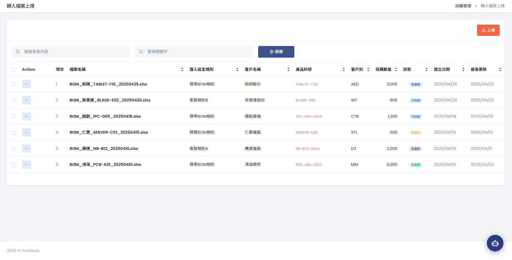


##### 上傳視窗
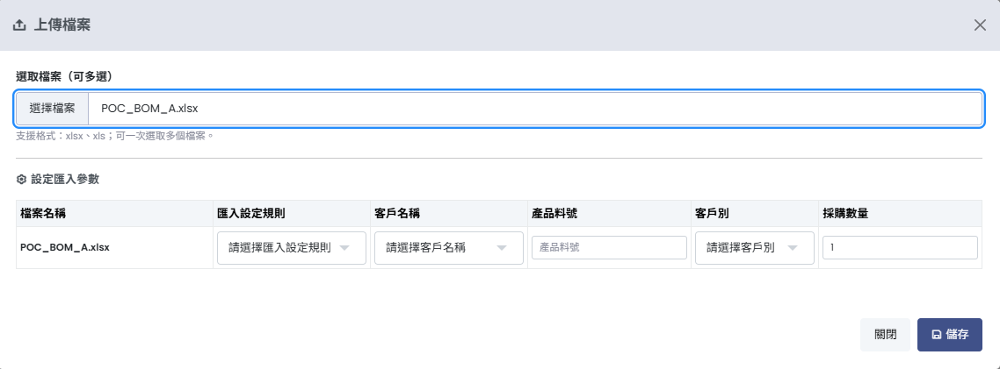


##### 編輯視窗
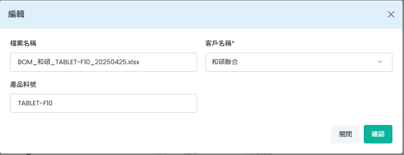


#### 清單表格欄位

| 欄位                | 說明                                                                                                            |
|---------------------|----------------------|
| 檔案名稱            | 上傳的 Excel 檔案名稱                                                                                           |
| 匯入規則            | 轉入時採用的欄位對應設定（對應「M03 檔案轉入資料表對應設定」中的設定項目），同時決定檔案上傳的 NAS 目的地資料夾 |
| 客戶名稱            | BOM 檔案所屬客戶                                                                                                |
| 產品料號            | BOM 檔案成品料號                                                                                                |
| 客戶別              | BOM 檔案在內部查價使用的 Variant Code 條件                                                                      |
| 採購數量            | 成品採購數量，用於外部 MOQ 查價計算                                                                             |
| 狀態                | 處理進度（見 §6）                                                                                               |
| 建立時間 / 最後更新 | 時間戳記                                                                                                        |

#### 操作功能

- 上傳：上傳 BOM 檔案（單次可多檔），並針對每個檔案設定匯入規則；若為 BOM 檔案，需額外設定客戶名稱、產品料號、客戶別、採購數量
- 編輯：編輯已上傳檔案的客戶名稱、產品料號
- 刪除：刪除單筆 / 批次刪除
- 關鍵字搜尋

#### 上傳設定欄位

每個上傳的 Excel 檔案需設定：

通用欄位：
| 欄位         | 必填 | 說明                                                               |
|--------------|------|--------------------------------------------------------------------|
| 匯入設定規則 | ✓    | 選擇 M03 中已建立的欄位對應設定，決定欄位轉換規則與 NAS 上傳目的地 |

BOM 檔案設定欄位：

| 欄位     | 必填 | 說明                                        |
|----------|------|---------------------------------------------|
| 客戶名稱 | ✓    | 選擇客戶名稱                                |
| 產品料號 |      | 成品料號，選填                              |
| 客戶別   | ✓    | 內部查價使用的 Variant Code 條件            |
| 採購數量 | ✓    | 正整數，成品採購數量，用於外部 MOQ 查價計算 |

---

### F02 定時查價結果

#### 功能說明

顯示 BOM 查價作業完成後的結果清單，可進入個別 BOM 檔案的詳細查價結果頁，檢視各料項的內部採購紀錄與外部報價，並可調整採購型號後重新查價。

#### 畫面示意

##### 清單頁
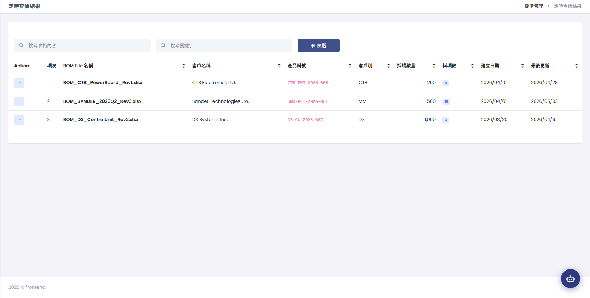


##### 結果頁
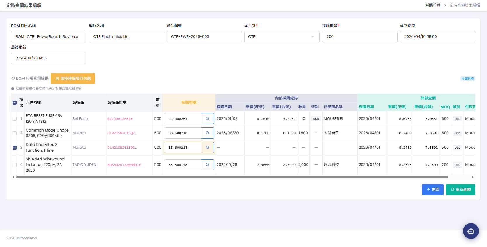


##### 選取採購型號視窗
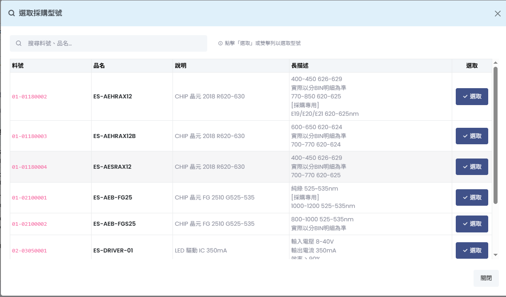


#### 清單頁表格欄位

| 欄位                | 說明                                       |
|---------------------|--------------------------------------------|
| BOM File 名稱       | 上傳的 BOM 檔案名稱                        |
| 客戶名稱            | BOM 檔案所屬客戶                           |
| 產品料號            | 成品料號                                   |
| 客戶別              | BOM 檔案在內部查價使用的 Variant Code 條件 |
| 採購數量            | 成品採購數量，用於外部 MOQ 查價計算        |
| 料項數              | BOM 中料項總數                             |
| 建立日期 / 最後更新 | 資料建立與最後更新的時間戳記               |

點選「結果」進入詳細查價結果頁。支援關鍵字全文搜尋。

#### 查價結果頁 — 表頭欄位

| 欄位                | 可編輯   | 說明                                   |
|---------------------|----------|----------------------------------------|
| BOM File 名稱       | ✗ 唯讀   | 上傳的 BOM 檔案名稱，不可修改          |
| 客戶名稱            | ✗ 唯讀   | BOM 檔案所屬客戶，不可修改             |
| 產品料號            | ✗ 唯讀   | BOM 成品料號，不可修改                 |
| 客戶別              | ✓ 可編輯 | 可更改後重新查價                       |
| 採購數量            | ✓ 可編輯 | 可更改後重新查價                       |
| 建立時間 / 最後更新 | ✗ 唯讀   | 資料建立與最後更新的時間戳記，不可修改 |

#### 查價結果頁 — BOM 料項欄位

| 群組         | 欄位              | 說明                               |
|--------------|-------------------|------------------------------------|
| 基本資訊     | 元件描述          | BOM Description                    |
|              | 製造商            | BOM Manufacturer                   |
|              | 製造商料號（MPN） | BOM Manufacturer Part Number       |
|              | 數量              | BOM 單位用量                       |
| 採購型號     | 採購型號          | 可手動編輯，**黃底**表示系統建議   |
| 內部採購紀錄 | 採購日期          | 命中的採購紀錄日期                 |
|              | 單價（原幣）      | 原幣單價                           |
|              | 單價（台幣）      | 換算台幣單價                       |
|              | 數量              | 該採購紀錄數量                     |
|              | 幣別              | USD / TWD 等                       |
|              | 供應商名稱        | 提供該採購紀錄的供應商名稱         |
| 外部查價     | 查價日期          | 外部報價取得日期                   |
|              | 單價（原幣）      | 外部報價原幣單價                   |
|              | 單價（台幣）      | 外部報價換算台幣單價               |
|              | MOQ               | 最小訂購量（對應實際查價量的階梯） |
|              | 幣別              | 外部報價幣別，如 USD / TWD 等      |
|              | 供應商名稱        | 提供外部報價的供應商名稱           |

#### 操作說明

- 採購型號欄位透過料號選取器選取
- 「切換建議項目勾選」：批次勾選／取消系統建議採購型號的項目
- 「重新查價」：更新客戶別或採購數量後觸發重新查價

---

### F03 料號快查

#### 功能說明

提供採購人員快速以單一製造商料號查詢內部採購紀錄與外部報價，不需上傳完整 BOM。結果以表格呈現，可調整採購型號並儲存，並可觸發重新查價。

#### 畫面示意

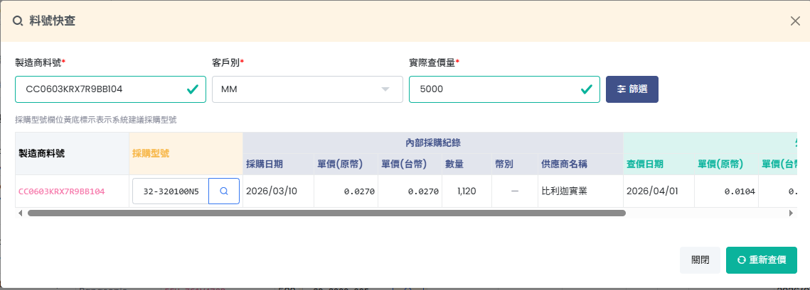

#### 查詢條件

| 欄位       | 必填 | 說明                                        |
|------------|------|---------------------------------------------|
| 製造商料號 | ✓    | 輸入完整 MPN                                |
| 客戶別     | ✓    | 內部查價使用的 Variant Code 條件            |
| 採購數量   | ✓    | 正整數，實際採購數量，用於外部 MOQ 階梯計算 |

#### 結果欄位與操作

結果欄位與「F02 定時查價結果」詳細查價結果頁的料項表格相同，包含：採購型號（可編輯）、內部採購紀錄 6 欄、外部查價 6 欄。

- **黃底標示**：系統建議採購型號以黃底標示
- 採購型號透過料號選取器選取
- 「重新查價」：批次儲存採購型號後觸發重新查價

---

#### 功能說明

提供採購人員快速以單一製造商料號查詢內部採購紀錄與外部報價，不需上傳完整 BOM。結果以表格呈現，可調整採購型號並儲存，並可觸發重新查價。

#### 查詢條件

| 欄位 | 必填 | 說明 |
|------|------|------|
| 製造商料號 | ✓ | 輸入完整或部分 MPN |
| 客戶別 | ✓ | MM / D3 / STL / CTB / WT / AED / EDS |
| 採購數量 | ✓ | 正整數，用於 MOQ 計算 |

#### 結果欄位與操作

結果欄位與查價結果頁料項表格相同，包含：採購型號（可編輯）、內部採購紀錄 6 欄、外部查價 6 欄。

- **黃底標示**：系統建議採購型號以黃底標示
- 採購型號可直接輸入或透過料號選取器選取
- 「重新查價」：批次儲存採購型號後觸發重新查價

---

## 5. AI對話中心
#### 功能說明

提供採購人員快速以單一製造商料號查詢內部採購紀錄、內部料號與外部報價，並以關鍵字查詢方式匯出定時查價結果的excel

功能:
1. 依廠商料號即時查內部料號
2. 依廠商料號顯示即時內部查價
3. 依廠商料號、實際查價量顯示即時外部查價
4. 產出報表-定時查價結果

#### 畫面示意
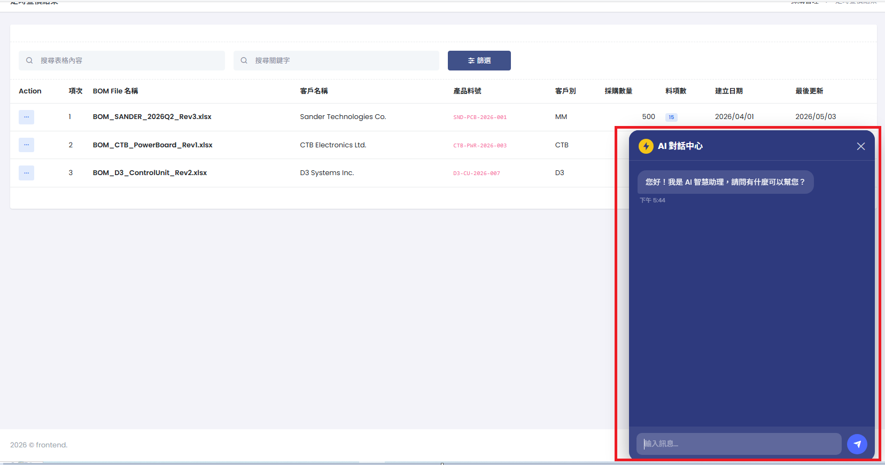


## 6. AI資料管理
AI資料管理模組負責介接AI做資料整理，可以是公司內部資料或是與BOM料號相關檔案資料做為查料的依據之一。
### A01 歷史資料上傳

#### 功能說明
主要用於公司內部運作資料、內部料號檔案紀錄、查料結果檔案上傳或是其他想保存的資料給AI做內容的簡單分析，以便之後需要取得資料時能快速查找。


#### 畫面示意

##### 清單頁
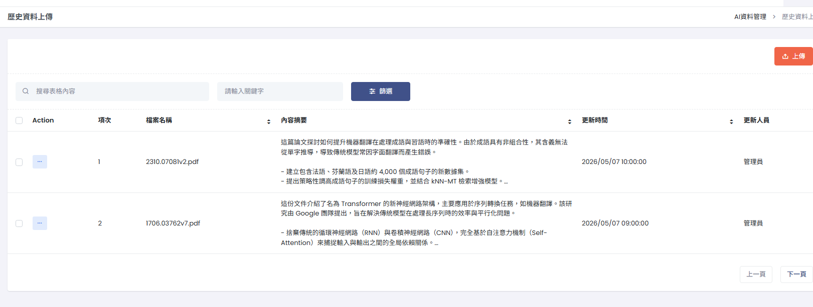

##### 上傳視窗
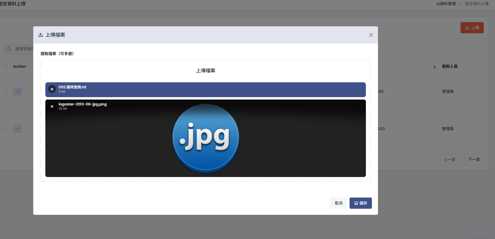

##### 編輯視窗
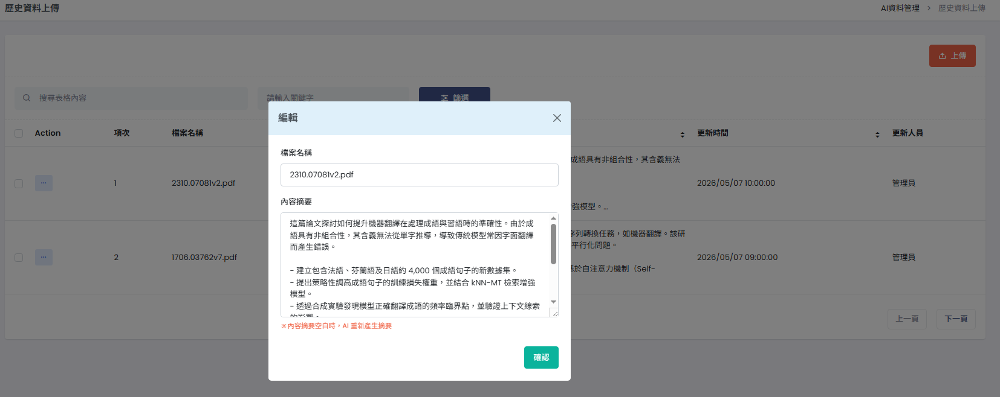

#### 清單表格欄位

| 欄位                | 說明                                                                                                            |
|---------------------|----------------------|
| 檔案名稱            | 上傳檔案名稱，是主要用作關鍵字搜尋的欄位                                                                                          |
| 內容摘要            | 上傳檔案中AI解析的內容摘要，是主要用作關鍵字搜尋的欄位|
| 更新時間            | 產生或更新內容摘要的時間                                                                                             |
| 更新人員           | 執行產生或更新內容摘要的帳號名稱                                                                                               |

#### 操作功能

- 上傳：上傳檔案（單次可多檔），格式不限
- 編輯：編輯已上傳檔案內容摘要
- 刪除：刪除單筆 / 批次刪除
- 關鍵字搜尋

#### 上傳功能
上傳歷史資料檔案，檔案格式不限，單次多檔，上傳圖片時會顯示該圖片，如下圖:
，按下確認會把這次上傳的檔案都解析出來並重新查詢歷史資料清單
> **上傳功能說明：** 同個檔案可重複上傳。

#### 編輯欄位

| 欄位 | 必填 | 說明 |
|------|------|------|
| 檔案名稱 | ✓ | 該檔案名稱(唯讀) |
| 內容摘要 |  | 該檔案的內容摘要，可以手動編輯，該欄位如果是空白，送出時會再由AI解析該檔案一次，產生新的內容摘要 |
---

## 7. 狀態碼定義

| 狀態碼 | 狀態文字 | 說明                                                    |
|--------|----------|---------------------------------------------------------|
| `0`    | 未轉檔   | 檔案已上傳，尚未執行欄位對應轉換                        |
| `1`    | 已轉檔   | 欄位對應完成，並以儲存置資料庫                          |
| `2`    | 未查料   | 已轉檔，尚未執行查詢採購型號作業，只有 BOM 檔案有此狀態 |
| `3`    | 已查料   | 查詢採購型號作業，只有 BOM 檔案有此狀態                 |
| `4`    | 已查價   | 內部 + 外部查價完成                                     |


